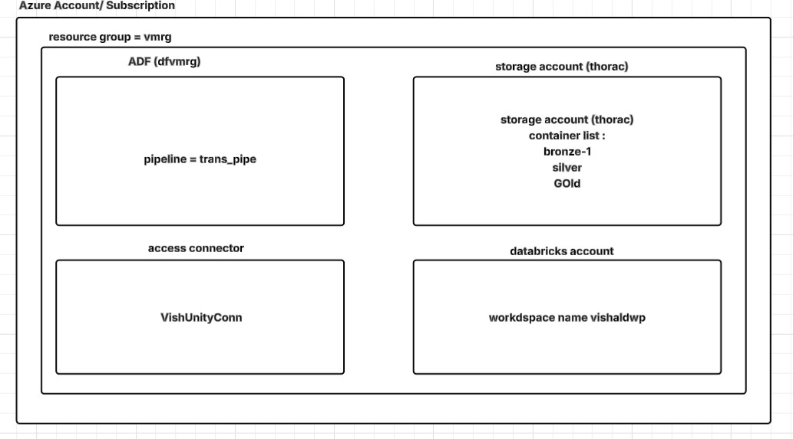
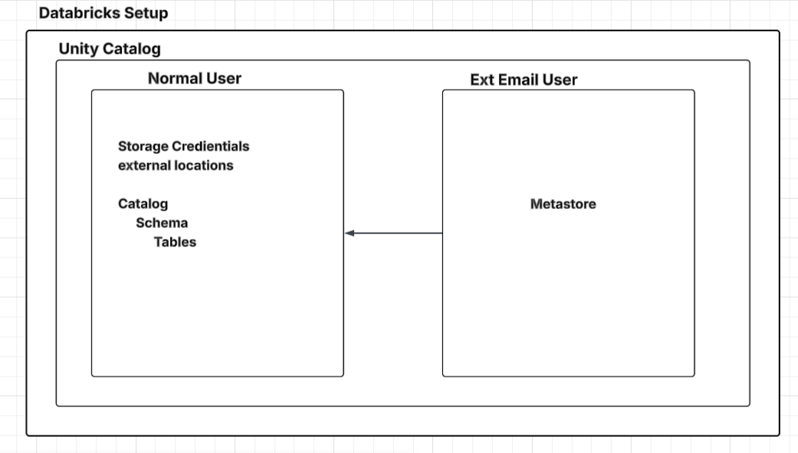
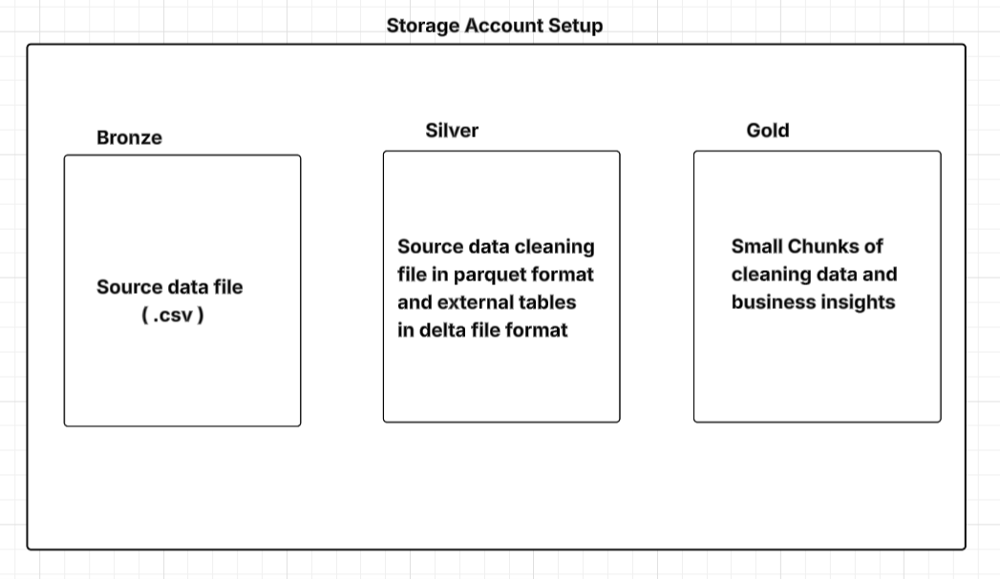

## **Banking Fraud Detection Project :**
End-to-end Data Engineering project to detect fraudulent banking transactions using Azure + Spark + Delta Lake architecture + Azure ADF.

## **Project Overview:**

This project builds a Fraud Detection Data Pipeline that:

* Ingests raw banking transactions
* Cleans and transforms data
* Applies fraud detection rules
* Stores curated fraud dataset
* Builds dashboard for insights

Architecture follows Medallion Architecture:

**Bronze → Silver → Gold**

## **Project Architecture :**

```
Source CSV
   ↓
Bronze Layer (Raw Data)
   ↓
Silver Layer (Cleaned Data)
   ↓
Gold Layer (Fraud Rules Applied)
   ↓
Power BI Dashboard
```

## **Pre-requisite / Technologies Used:**

1) Azure Data Lake Storage Gen2
2) Azure Databricks
3) PySpark
5) Power BI
6) Python
7) SQL
8) Unity Catalog
9) Azure ADF

## **Project Structure :**

```
notebooks/
│
├── catalog_notebook
├── bronze_notebook
├── silver_notebook
├── gold_notebook
├── bank_transaction_insights
│
data/
│
├── transactions.csv

output_screens/
│
├── screenshots
```


## **Infrastructure Setup:**



## **Databricks Setup:**


## **Storage account Setup:**
