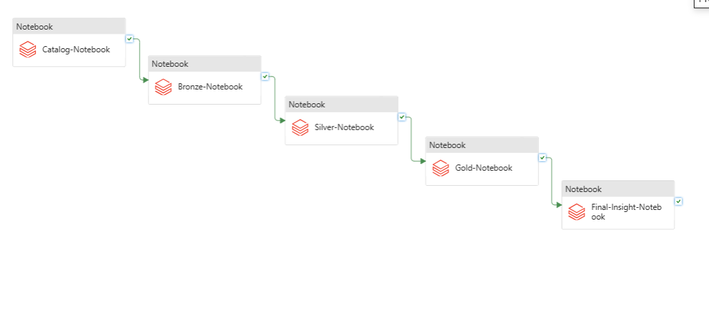
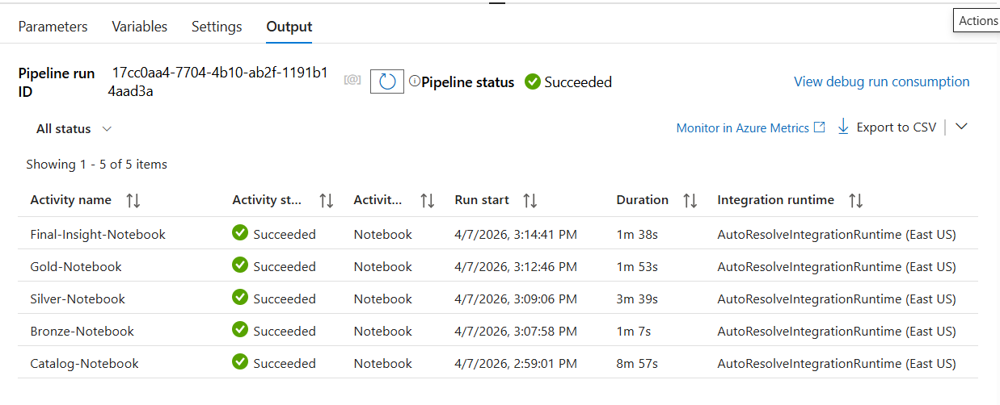
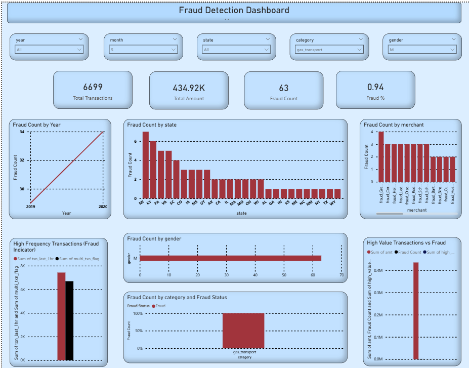
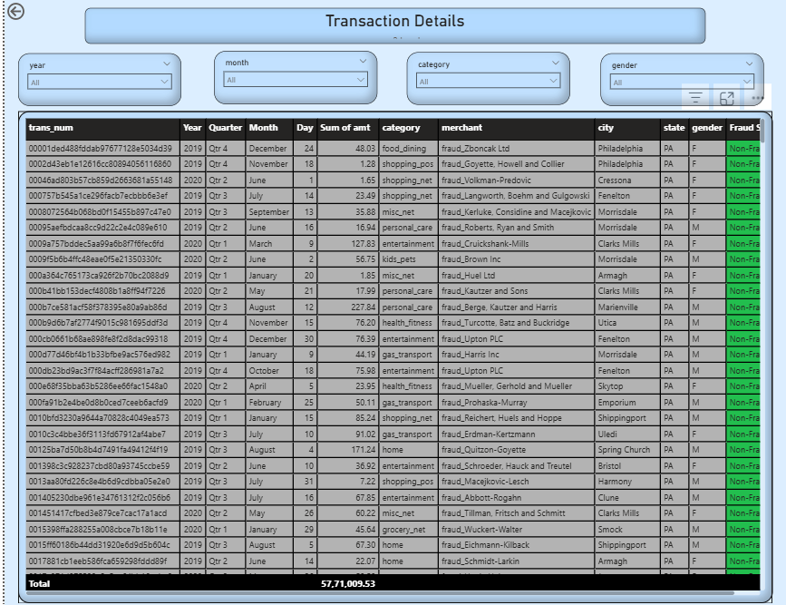

## **Repository Structure :**

```

Data/
│
├── transactions.csv
│
Notebooks/
│
├── catalog_notebook
├── bronze_notebook
├── silver_notebook
├── gold_notebook
├── bank_transaction_insights
│
Output_screens/
│
├── screenshots
│
PowerBi-dashboard-screens/
│
├── dashboard screenshots

```


## **Banking Fraud Detection Project :**
```
   End-to-end Data Engineering project to detect fraudulent banking transactions using Azure + Spark + Delta Lake architecture + Azure ADF.
```

## **Project Overview:**

This project builds a Fraud Detection Data Pipeline that:

* Ingests raw banking transactions
* Cleans and transforms data
* Applies fraud detection rules
* Stores curated fraud dataset
* Builds dashboard for insights
```
Architecture follows Medallion Architecture:

Bronze → Silver → Gold
```

## **Project Architecture :**

```
Source CSV
   ↓
Bronze Layer (Raw Data)
   ↓
Silver Layer (Cleaned Data)
   ↓
Gold Layer (Fraud Rules Applied)
   ↓
Power BI Dashboard
```

## **Pre-requisite / Technologies Used:**
```
   1) Azure Data Lake Storage Gen2
   2) Azure Databricks
   3) PySpark
   5) Power BI
   6) Python
   7) SQL
   8) Unity Catalog
   9) Azure ADF
```

## **Azure Infrastructure Setup:**


## **Databricks Setup:**


## **Storage account Setup:**


## **ADF pipeline Setup:**
* For ADF pipeline we need to create link service. Here i want to link azure databricks to ADF. So for this i create one link service name as **AzureDatabricks**.



* In this pipeline i call the databricks notebooks to generate business insights.

## **pipeline OutPut:**


## **Notebooks Explaination:**
use of each notebook are as follows:

### **1) Databricks_Setup_Notebook.py:**
* This spark notebook use to setup the required environment in databricks workspace.
* This notebook perform following operations:
   ```
      1) create storage credientails.
      2) create external location.
      3) create catalog.
      4) create schema.
      5) add permissions.
   
   ```

### **2) bronze_Notebook.py:**

* This spark notebook read source raw data from storage account broze container.
* This notebook perform following operations:
   ```
      1) Read the source data.
      2) describe schema of source data.
   ```

### **3) Silver_Notebook.py:**

* This spark notebook perform following operations:
   ```
      1) Read the data from bronze container.
      2) Clean source data.
      3) Check null values.
      4) generate parquet files from clean data.
      5) Transfer parquet file in silver container.
      6) create managed and external tables.
      7) perform optimizations.
   ```

### **4) gold_Notebook.py:**
* This spark notebook perform following operations:
   ```
     1) adding new column in cleaning dataset
     2) perform optimization.
     3) generate parquet files from clean data.
     4) Divide cleaning data into small small chunks/tables to generate business insight.
     5) store data as managed and external tables.
   ```

   ### **5) bank_transaction_insights.py:**
* This spark notebook perform following operations:
   ```
     1) perform windows operation to generate business insights.
   ```


   ## **PowerBi Dashboard Metrics :**

   * To Create Power Bi dashboard here i used Dax query and and for advance business insight i add new derived columns and new measures.

   ```
   Power BI dashboard shows:
         1) Total Transactions
         2) Total Fraud Transactions
         3) Fraud Percentage
         4) Fraud by Category
         5) Fraud by Gender
         6) Fraud by Year
         7) Transaction Trend
   ```


   ## **PowerBi Dashboard screens:**

   ### Page 1 : (Graphical Representation)

   

    ### Page 2 :( Representation in tabular format )

   


